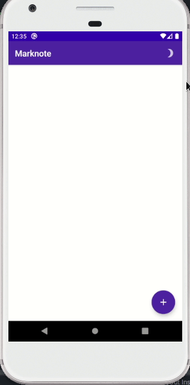

# Marknote-Compose [WIP]

A recode using Jetpack Compose from my previous [Marknote app](https://github.com/DevSrSouza/Marknote/) built in Flutter.

## Dependencies

| Dependency | Version |
| ---- | ---- |
| androidx.ui | 0.1.0-dev08 |
| androidx.room | 2.2.5 |

## Current State

